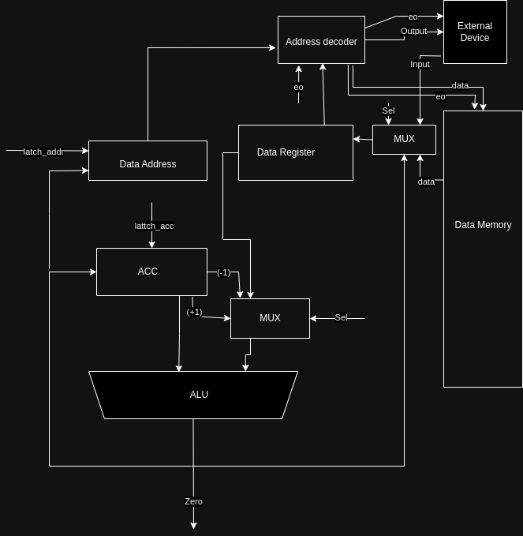

# На кончиках пальцев

- Зуев Никита Александрович
- `asm | acc | harv | hw | instr | struct | stream | mem | pstr | prob5 | -`
- Упрощенный вариант.

## Язык программирования

Синтаксис в расширенной БНФ.

- `[ ... ]` -- вхождение 0 или 1 раз
- `{ ... }` -- повторение 0 или несколько раз
- `{ ... }-` -- повторение 1 или несколько раз

``` ebnf
program ::= [data_section] [code_section]

data_section ::= ".data\n" {data_line}

code_section ::= ".text\n" {code_line}

data_line ::= label [comment] "\n"
            | integer [comment] "\n"
            | string [comment] "\n"

integer ::= [ "-" ] { <any of "0-9"> }-
string '"' { <any symbols> } '"'

code_line ::= label [ comment ] "\n"
            | instr [ comment ] "\n"
            | [ comment ] "\n"

label ::= label_name ":"

instr ::= op0
        | op1 label_name

op0 ::= "inc"
      | "dec"
      | "halt"

op1 ::= "jmp"
      | "jz"
      | "jnz"
      | "store"
      | "load"
      | "st"
      | "ld"
      | "add"
      | "sub"
      | "mul"
      | "div"
      | "mod"
      | "mov"

label_name ::= <any of "a-z A-Z _"> { <any of "a-z A-Z 0-9 _"> }

comment ::= ";" <any symbols except "\n">
```

Поддерживаются однострочные комментарии, начинающиеся с `;`.

Метки для переходов определяются на отдельных строчках:

``` asm
label: 
    inc
```

И в другом месте (неважно, до или после определения) сослаться на эту метку:

``` asm
jmp label   ; --> `jmp 123`, где 123 - номер инструкции после объявления метки
```

Транслятор поставит на место использования метки адрес той инструкции, перед которой она определена.

В программе не может быть дублирующихся меток, определенных в разных местах с одним именем.

## Организация памяти

Модель памяти процессора (приведено списком, так как тривиальна):

1. Память команд. Машинное слово -- не определено. Реализуется списком словарей, описывающих инструкции (одно слово -- одна ячейка).
2. Память данных. Машинное слово -- 32 бит, знаковое. Линейное адресное пространство. Реализуется списком чисел.

```text
       Registers
+--------------------------------+
| acc                            |
+--------------------------------+

       Instruction memory
+--------------------------------+
| 00  : {"opcode":..., "arg":...}|
|    ...                         |
|    ...                         |
+------------------------------+

          Data memory
+------------------------------+
| 00  : Memory mapped input    |
| 01  : Memory mapped output   |
|    ...                       |
| v+0 : any static variable    |
| v+1 : any static variable    |
|    ...                       |
| h+0 : heap                   |
+------------------------------+
```

Первые две ячейки памяти данных недоступны для использования. Они зарезервированы для ввода и вывода.

Константы и литералы отсутствуют. Строки располагаются в памяти данных по символу на одно машинное слово. Перед строкой находятся данные о её длине (pstr).

## Система команд

Особенности процессора:

- Инструкция являтется структурой, поэтому понятие машинного слова к памяти исполняемого кода не применимо. 1 ячейка памяти вмещает всю информцию об инструкции (опкод, аргумент, инфорамация об исходном коде)
- Доступ к памяти данных осуществляется по адресу, хранящемуся в специальном регистре `data_address`. Установка адреса осуществляется неявно, когда используются команды с доступом к памяти.
- Поток управления:
    - инкремент `PC` после каждой инструкции;
    - условный (`jz` и `jnz`) и безусловный (`jmp`) переходы.

### Набор инструкций

| Команда  |Тактов| Описание | Семантика |
|-|-|-|-|
| inc |1| Инкремент | acc + 1 -> acc |
| dec |1| Декримент | acc - 1 -> acc |
| add |2| Сумма acc и mem | acc + mem -> acc |
| sub |2| Разница acc и mem| acc - mem -> acc |
| mul |2| Произведение acc и mem | acc * mem -> acc |
| div |2| Частное acc и mem| acc / mem -> acc |
| mod |2| Остаток от деления acc и mem | acc % mem -> acc |
| mov |1| Загрузить в acc адрес метки | addr -> acc |
| load |2| Загрузить в acc из памяти по адресу метки | [addr] -> acc |
| store |2| Загрузить в память по адресу метки из acc | acc -> [addr] |
| ld |3| load с косвенной адресацией | [[addr]] -> acc |
| st |3| store с косвенной адресацией | acc -> [[addr]]|
| jmp |1| безусловный переход | addr -> pc|
| jz |1| переход, если acc = 0 | если acc = 0, то addr -> pc |
| jnz |1| переход, если acc != 0 | если acc != 0, то addr -> pc |
| halt |0| остановка | остановка выполнения программы |

### Кодирование инструкций

- Машинный код сериализуется в список JSON.
- Один элемент списка -- одна инструкция.
- Индекс списка -- адрес инструкции. Используется для команд перехода.

Пример:

```json
[
    {
        "opcode": "jz",
        "arg": 5,
        "term": [
            1,
            "jz labelname"
        ]
    }
]
```

где:

- `opcode` -- строка с кодом операции;
- `arg` -- аргумент (может отсутствовать);
- `term` -- информация о связанном месте в исходном коде (если есть).

Типы данных в модуле [isa](./python/isa.py), где:

- `Opcode` -- перечисление кодов операций;
- `Term` -- структура для описания значимого фрагмента кода исходной программы.

## Транслятор

Интерфейс командной строки: `translator.py <input_file> <target_file>`

Реализовано в модуле: [translator](./python/translator.py)

Этапы трансляции (функция `translate`):

1. Трансформирование текста в последовательность значимых термов для блока кода и массива данных для блока данных.
2. Подстановка фактических адресов вместо меток.
3. Генерация машинного кода.

## Модель процессора

Интерфейс командной строки: `machine.py <machine_code_file> <input_file>`

Реализовано в модуле: [machine](./python/machine.py).

### DataPath



Реализован в классе `DataPath`.

`data_memory` -- однопортовая память, поэтому либо читаем, либо пишем.

Сигналы (обрабатываются за один такт, реализованы в виде методов класса):

- `latch_data_addr` -- защёлкнуть выбранное значение в `data_addr`;

- `latch_acc` -- защёлкнуть в аккумулятор выход памяти данных;

- `wr` -- записать выбранное значение в память:

- `noarg` -- выполняет одну из команд:
    - `inc` -- инкремент аккумулятора;
    - `dec` -- декремент аккумулятора;
- `set_acc` -- установить значение аккумулятора;
- `addr_by_addr` -- установить косвенный адрес;
- `arg` -- выполняет арифметические команды с аргументом;

Флаги:

- `zero` -- отражает наличие нулевого значения в аккумуляторе.

### ControlUnit


Реализован в классе `ControlUnit`.

- Hardwired.
- Метод `decode_and_execute_instruction` моделирует выполнение полного цикла инструкции.
- Метод `decode_and_execute_control_flow_instruction` моделирует выполнение управляющих инструкций (`jmp`, `jz`, `jnz`, `halt`).
- `program` -- память команд.

Сигнал:

- `latch_program_counter` -- сигнал для обновления счётчика команд в ControlUnit.

Особенности работы модели:

- Цикл симуляции осуществляется в функции `simulation`.
- Шаг моделирования соответствует одной инструкции с выводом
- `halt` -- остановка выполнения программы.тояния в журнал.
- Для журнала состояний процессора используется стандартный модуль `logging`.
- Количество инструкций для моделирования лимитировано.
- Остановка моделирования осуществляется при:
    - превышении лимита количества выполняемых инструкций;
    - исключении `EOFError` -- если нет данных для чтения из порта ввода;
    - исключении `StopIteration` -- если выполнена инструкция `halt`.

## Тестирование

Тестирование выполняется при помощи golden test-ов.

Тесты для языка `asm` реализованы в: [golden_test.py](./golden_test.py). Конфигурации:

- [golden/cat.yml](golden/cat.yml)
- [golden/hello.yml](golden/hello.yml)
- [golden/hello_user_name.yml](golden/hello_user_name.yml)
- [golden/prob5.yml](golden/prob5.yml)

Запустить тесты: `poetry run pytest . -v`

Обновить конфигурацию golden tests:  `poetry run pytest . -v --update-goldens`

CI при помощи Github Action:

``` yaml
defaults:
  run:
    working-directory: ./python

jobs:
  test:
    runs-on: ubuntu-latest

    steps:
      - name: Checkout code
        uses: actions/checkout@v4

      - name: Set up Python
        uses: actions/setup-python@v4
        with:
          python-version: 3.11

      - name: Install dependencies
        run: |
          python -m pip install --upgrade pip
          pip install poetry
          poetry install

      - name: Run tests and collect coverage
        run: |
          poetry run coverage run -m pytest .
          poetry run coverage report -m
        env:
          CI: true

  lint:
    runs-on: ubuntu-latest

    steps:
      - name: Checkout code
        uses: actions/checkout@v4

      - name: Set up Python
        uses: actions/setup-python@v4
        with:
          python-version: 3.11

      - name: Install dependencies
        run: |
          python -m pip install --upgrade pip
          pip install poetry
          poetry install

      - name: Check code formatting with Ruff
        run: poetry run ruff format --check .

      - name: Run Ruff linters
        run: poetry run ruff check .
```

где:

- `poetry` -- управления зависимостями для языка программирования Python.
- `coverage` -- формирование отчёта об уровне покрытия исходного кода.
- `pytest` -- утилита для запуска тестов.
- `ruff` -- утилита для форматирования и проверки стиля кодирования.

Пример использования и журнал работы процессора на примере `cat`:

``` shell
$ cat example/cat.txt 
ku ka
re ku
$ cat examples/cat.asm
.data
input:
0
output:
0

.text
start:
load input
store output
jmp start
halt
$ python translator.py example/cat.asm example/cat.out  
source LoC: 13 code instr: 8
$ cat example/cat.out
[".data",
 0,
 0,
 ".text",
 {"index": 0, "opcode": "load", "arg": 0, "term": [9, "load input"]},
 {"index": 1, "opcode": "store", "arg": 1, "term": [10, "store output"]},
 {"index": 2, "opcode": "jmp", "arg": 0, "term": [11, "jmp start"]},
 {"index": 3, "opcode": "halt", "term": [12, "halt"]}]
$ ./machine.py target.out examples/foo_input.txt
DEBUG:root:TICK: 0 PC: 0 ADDR: 0 MEM_OUT: 0 ACC: 0      load 0  ('load input'@9)
DEBUG:root:input: 'k' 
DEBUG:root:TICK: 2 PC: 1 ADDR: 0 MEM_OUT: 0 ACC: 107    store 1  ('store output'@10)
DEBUG:root:output: 'k' << 'k'
DEBUG:root:TICK: 4 PC: 2 ADDR: 1 MEM_OUT: 0 ACC: 107    jmp 0  ('jmp start'@11)
DEBUG:root:TICK: 5 PC: 0 ADDR: 1 MEM_OUT: 0 ACC: 107    load 0  ('load input'@9)
DEBUG:root:input: 'u' 
DEBUG:root:TICK: 7 PC: 1 ADDR: 0 MEM_OUT: 0 ACC: 117    store 1  ('store output'@10)
DEBUG:root:output: 'ku' << 'u'
DEBUG:root:TICK: 9 PC: 2 ADDR: 1 MEM_OUT: 0 ACC: 117    jmp 0  ('jmp start'@11)
DEBUG:root:TICK: 10 PC: 0 ADDR: 1 MEM_OUT: 0 ACC: 117   load 0  ('load input'@9)
DEBUG:root:input: ' ' 
DEBUG:root:TICK: 12 PC: 1 ADDR: 0 MEM_OUT: 0 ACC: 32    store 1  ('store output'@10)
DEBUG:root:output: 'ku ' << ' '
DEBUG:root:TICK: 14 PC: 2 ADDR: 1 MEM_OUT: 0 ACC: 32    jmp 0  ('jmp start'@11)
DEBUG:root:TICK: 15 PC: 0 ADDR: 1 MEM_OUT: 0 ACC: 32    load 0  ('load input'@9)
DEBUG:root:input: 'k' 
DEBUG:root:TICK: 17 PC: 1 ADDR: 0 MEM_OUT: 0 ACC: 107   store 1  ('store output'@10)
DEBUG:root:output: 'ku k' << 'k'
DEBUG:root:TICK: 19 PC: 2 ADDR: 1 MEM_OUT: 0 ACC: 107   jmp 0  ('jmp start'@11)
DEBUG:root:TICK: 20 PC: 0 ADDR: 1 MEM_OUT: 0 ACC: 107   load 0  ('load input'@9)
DEBUG:root:input: 'a' 
DEBUG:root:TICK: 22 PC: 1 ADDR: 0 MEM_OUT: 0 ACC: 97    store 1  ('store output'@10)
DEBUG:root:output: 'ku ka' << 'a'
DEBUG:root:TICK: 24 PC: 2 ADDR: 1 MEM_OUT: 0 ACC: 97    jmp 0  ('jmp start'@11)
DEBUG:root:TICK: 25 PC: 0 ADDR: 1 MEM_OUT: 0 ACC: 97    load 0  ('load input'@9)
DEBUG:root:input: '\n' 
DEBUG:root:TICK: 27 PC: 1 ADDR: 0 MEM_OUT: 0 ACC: 10    store 1  ('store output'@10)
DEBUG:root:output: 'ku ka\n' << '\n'
DEBUG:root:TICK: 29 PC: 2 ADDR: 1 MEM_OUT: 0 ACC: 10    jmp 0  ('jmp start'@11)
DEBUG:root:TICK: 30 PC: 0 ADDR: 1 MEM_OUT: 0 ACC: 10    load 0  ('load input'@9)
DEBUG:root:input: 'r' 
DEBUG:root:TICK: 32 PC: 1 ADDR: 0 MEM_OUT: 0 ACC: 114   store 1  ('store output'@10)
DEBUG:root:output: 'ku ka\nr' << 'r'
DEBUG:root:TICK: 34 PC: 2 ADDR: 1 MEM_OUT: 0 ACC: 114   jmp 0  ('jmp start'@11)
DEBUG:root:TICK: 35 PC: 0 ADDR: 1 MEM_OUT: 0 ACC: 114   load 0  ('load input'@9)
DEBUG:root:input: 'e' 
DEBUG:root:TICK: 37 PC: 1 ADDR: 0 MEM_OUT: 0 ACC: 101   store 1  ('store output'@10)
DEBUG:root:output: 'ku ka\nre' << 'e'
DEBUG:root:TICK: 39 PC: 2 ADDR: 1 MEM_OUT: 0 ACC: 101   jmp 0  ('jmp start'@11)
DEBUG:root:TICK: 40 PC: 0 ADDR: 1 MEM_OUT: 0 ACC: 101   load 0  ('load input'@9)
DEBUG:root:input: ' ' 
DEBUG:root:TICK: 42 PC: 1 ADDR: 0 MEM_OUT: 0 ACC: 32    store 1  ('store output'@10)
DEBUG:root:output: 'ku ka\nre ' << ' '
DEBUG:root:TICK: 44 PC: 2 ADDR: 1 MEM_OUT: 0 ACC: 32    jmp 0  ('jmp start'@11)
DEBUG:root:TICK: 45 PC: 0 ADDR: 1 MEM_OUT: 0 ACC: 32    load 0  ('load input'@9)
DEBUG:root:input: 'k' 
DEBUG:root:TICK: 47 PC: 1 ADDR: 0 MEM_OUT: 0 ACC: 107   store 1  ('store output'@10)
DEBUG:root:output: 'ku ka\nre k' << 'k'
DEBUG:root:TICK: 49 PC: 2 ADDR: 1 MEM_OUT: 0 ACC: 107   jmp 0  ('jmp start'@11)
DEBUG:root:TICK: 50 PC: 0 ADDR: 1 MEM_OUT: 0 ACC: 107   load 0  ('load input'@9)
DEBUG:root:input: 'u' 
DEBUG:root:TICK: 52 PC: 1 ADDR: 0 MEM_OUT: 0 ACC: 117   store 1  ('store output'@10)
DEBUG:root:output: 'ku ka\nre ku' << 'u'
DEBUG:root:TICK: 54 PC: 2 ADDR: 1 MEM_OUT: 0 ACC: 117   jmp 0  ('jmp start'@11)
DEBUG:root:TICK: 55 PC: 0 ADDR: 1 MEM_OUT: 0 ACC: 117   load 0  ('load input'@9)
WARNING:root:Input buffer is empty!
INFO:root:output_buffer: 'ku ka\nre ku'
ku ka
re ku
instr_counter:  33 ticks: 56
```

Пример проверки исходного кода:

``` shell
$ poetry run pytest . -v
=================================== test session starts ====================================
platform linux -- Python 3.11.8, pytest-7.4.4, pluggy-1.4.0 -- /home/exdo/Documents/ITMO/AC/lab3/.venv/bin/python
cachedir: .pytest_cache
rootdir: /home/exdo/Documents/ITMO/AC/lab3
configfile: pyproject.toml
plugins: golden-0.2.2
collected 4 items                                                                                                                                                                      

golden_test.py::test_translator_asm_and_machine[golden/prob5.yml] PASSED                                                                                                         [ 25%]
golden_test.py::test_translator_asm_and_machine[golden/hello.yml] PASSED                                                                                                         [ 50%]
golden_test.py::test_translator_asm_and_machine[golden/cat.yml] PASSED                                                                                                           [ 75%]
golden_test.py::test_translator_asm_and_machine[golden/hello_user_name.yml] PASSED                                                                                               [100%]

================================================================================== 4 passed in 0.10s ===================================================================================
$ poetry run ruff check .
$ poetry run ruff format .
4 files left unchanged
```

```text
| ФИО                       | алг             | LoC     | code байт | code инстр. | инстр. | такт. | вариант                                                                    |
| Зуев Никита Александрович | hello           | 30      | -         | 34          | 121    | 215   | asm | acc | harv | hw | instr | struct | stream | mem | pstr | prob5 | -   |
| Зуев Никита Александрович | cat             | 11      | -         | 8           | 21     | 36    | asm | acc | harv | hw | instr | struct | stream | mem | pstr | prob5 | -   |
| Зуев Никита Александрович | hello_user_name | 118     | -         | 107         | 363    | 642   | asm | acc | harv | hw | instr | struct | stream | mem | pstr | prob5 | -   |
| Зуев Никита Александрович | prob5           | 83      | -         | 56          | 1049   | 1732  | asm | acc | harv | hw | instr | struct | stream | mem | pstr | prob5 | -   |
```
